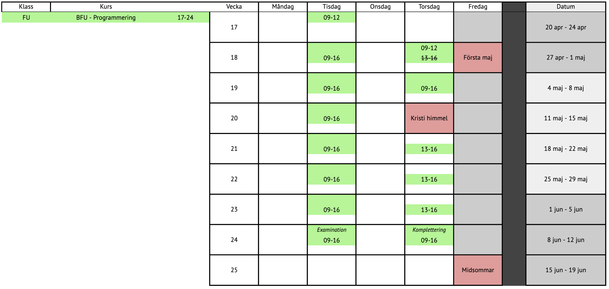

# BFU-2026

Välkommen till kursrepo för **BFU-2026**. Här samlar vi lektionskod, veckouppgifter, projekt och resurser vecka för vecka.

## Schema

Här finns klassens översiktsschema för snabb åtkomst.

[Öppna schema som bild](./BFU-schema.png)

## Kursens mål

- Bygga stabil grund inom webbutveckling (HTML, CSS, JavaScript).
- Förstå logik, datastrukturer och DOM-hantering i JavaScript.
- Arbeta med API:er och asynkron programmering.
- Träna på att strukturera kod, felsöka och leverera mindre projekt.
- Förbereda examination med tydlig dokumentation och arbetsflöde.

## Kursupplägg vecka för vecka

| Vecka | Tema | Mapp |
| --- | --- | --- |
| v17 | Intro | `01-vecka-17-intro` |
| v18 | HTML/CSS | `02-vecka-18-html-css` |
| v19 | Logik | `03-vecka-19-logik` |
| v20 | JavaScript grunder | `04-vecka-20-js-grunder` |
| v21 | JavaScript datastrukturer | `05-vecka-21-js-datastrukturer` |
| v22 | JavaScript DOM | `06-vecka-22-js-dom` |
| v23 | API och async | `07-vecka-23-api-async` |
| v24 | Examination | `08-vecka-24-examination` |

## Lektionsinspelningar

Samlade länkar till inspelningar för enkel åtkomst (utöver Discord).

### BFU Introduktion

- [Del 1](https://zocom-my.sharepoint.com/:v:/g/personal/linus_ilbratt_zocom_se/IQCWho_dOER6QLSeYEUYrhcnAYkggxU2jiR6VlaZGJpP-G4?nav=eyJyZWZlcnJhbEluZm8iOnsicmVmZXJyYWxBcHAiOiJTdHJlYW1XZWJBcHAiLCJyZWZlcnJhbFZpZXciOiJTaGFyZURpYWxvZy1MaW5rIiwicmVmZXJyYWxBcHBQbGF0Zm9ybSI6IldlYiIsInJlZmVycmFsTW9kZSI6InZpZXcifX0%3D&e=ujzXGE)
- [Del 2](https://zocom-my.sharepoint.com/:v:/g/personal/linus_ilbratt_zocom_se/IQCtXwqD_mAcQaAZYbs2zmdOAQOezqBNRFXHyrwmZPOdQjw?nav=eyJyZWZlcnJhbEluZm8iOnsicmVmZXJyYWxBcHAiOiJTdHJlYW1XZWJBcHAiLCJyZWZlcnJhbFZpZXciOiJTaGFyZURpYWxvZy1MaW5rIiwicmVmZXJyYWxBcHBQbGF0Zm9ybSI6IldlYiIsInJlZmVycmFsTW9kZSI6InZpZXcifX0%3D&e=4Ylah4)

### JS Datastrukturer (Vecka 21)

- [Del 1](https://zocom-my.sharepoint.com/:v:/g/personal/linus_ilbratt_zocom_se/IQDdOMzd8v2JRqWbcCAdNq1DAe7whchepVohqF-qQX8FcRA?nav=eyJyZWZlcnJhbEluZm8iOnsicmVmZXJyYWxBcHAiOiJTdHJlYW1XZWJBcHAiLCJyZWZlcnJhbFZpZXciOiJTaGFyZURpYWxvZy1MaW5rIiwicmVmZXJyYWxBcHBQbGF0Zm9ybSI6IldlYiIsInJlZmVycmFsTW9kZSI6InZpZXcifX0%3D&e=a6h5Lm)
- [Del 2](https://zocom-my.sharepoint.com/:v:/g/personal/linus_ilbratt_zocom_se/IQAQnhFQZw__RaXkAtj16-mXAc1jzAUjyaYhTx63_8kVH7M?nav=eyJyZWZlcnJhbEluZm8iOnsicmVmZXJyYWxBcHAiOiJTdHJlYW1XZWJBcHAiLCJyZWZlcnJhbFZpZXciOiJTaGFyZURpYWxvZy1MaW5rIiwicmVmZXJyYWxBcHBQbGF0Zm9ybSI6IldlYiIsInJlZmVycmFsTW9kZSI6InZpZXcifX0%3D&e=jIzQrh)

## Snabbnavigering

- [Vecka 17 - Intro](./01-vecka-17-intro/README.md)
- [Vecka 18 - HTML/CSS](./02-vecka-18-html-css/README.md)
- [Vecka 19 - Logik](./03-vecka-19-logik/README.md) 
- [Vecka 20 - JS grunder](./04-vecka-20-js-grunder/README.md) 
- [Vecka 21 - JS datastrukturer](./05-vecka-21-js-datastrukturer/README.md) 
- [Vecka 22 - JS DOM](./06-vecka-22-js-dom/README.md) 
- [Vecka 23 - API och async](./07-vecka-23-api-async/README.md) 
- [Vecka 24 - Examination](./08-vecka-24-examination/README.md) 
